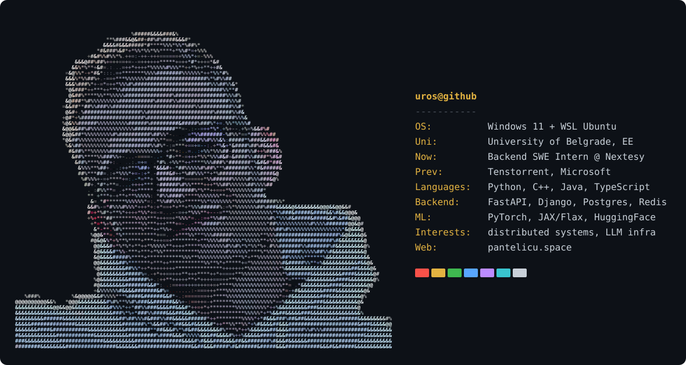

# Hi, I am Uroš

### Open source work

**[Llama3.1-8B-Jax-Parallel](https://github.com/pantela002/Llama3.1-8B-Jax-Paralel)**:
tensor-parallel JAX implementation of LLaMA 3.1 8B on a 1x4 device mesh, running
sharded and unsharded and matching the Hugging Face PyTorch reference. Done as part
of my work on [Tenstorrent's TT-XLA](https://github.com/tenstorrent/tt-xla).

**[Llama-Jax-Parallelism](https://github.com/pantela002/Llama-Jax-Paralelism)**:
the same model scaled to a 2x4 device mesh, with numerical parity checks against
the PyTorch baseline.

### Other things I'm proud of

- **[Qualcomm LPCVC 2025](https://github.com/pantela002/LPCV_2025_T1), 3rd place.** Image classification under distribution shift,
  deployed on a Snapdragon 8 Elite through Qualcomm AI Hub. We presented it at CVPR 2025 in Nashville.
- **Agent orchestrator.** A CLI and daemon that runs several coding agents in parallel,
  each in its own git worktree and tmux session, pulling from a shared task queue.
  Tasks can be parked and resumed on any idle worker without losing work.
- **[pantelicu.space](https://pantelicu.space)** ([source](https://github.com/pantela002/remember)).
  My personal site, plain HTML/CSS/JS, with a map of places I like in Belgrade and my gym split.
